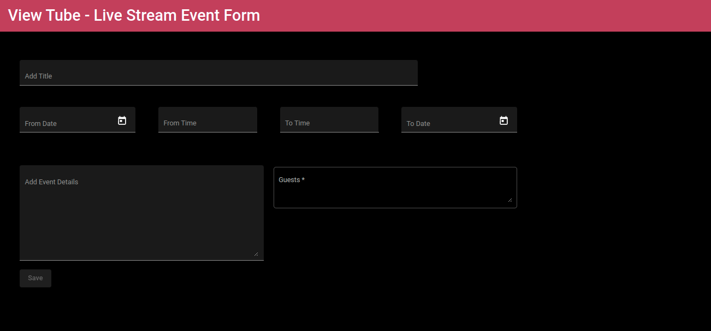
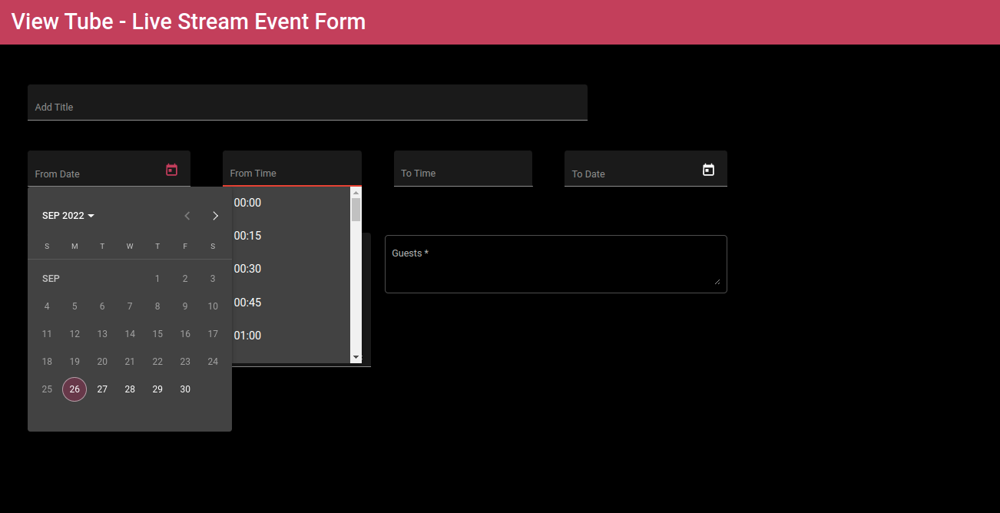
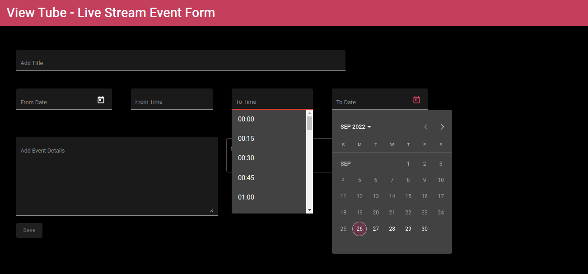
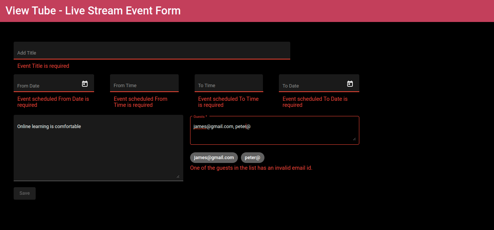
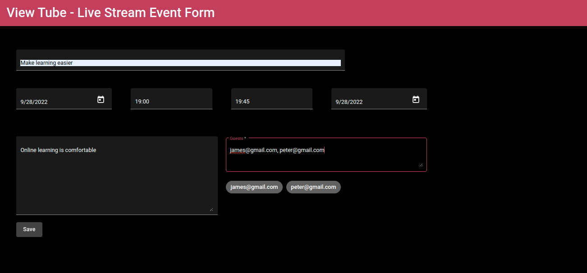
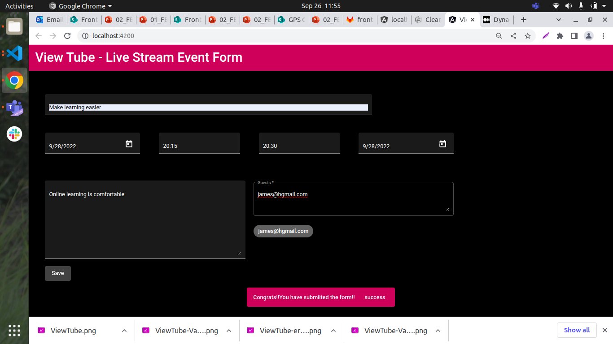

# Develop a Reactive Form for ViewTube application

## Context

The Front-end development team at eZone created the ViewTube application which rendered videos as cards with brief description, the number of views, the duration since it was published, and the length of video. The team was able to search for a particular video using the search box. ​

The eZone developer team wants to expand their market by attracting a greater number of users to their ViewTube application. For this, they have produced the plan of scheduling live events over the OTT platform called ViewTube Live.​

ViewTube Live is an easy way for creators to reach their community in real time. Whether streaming an event, teaching a class or hosting a workshop, ViewTube has tools that will help manage live streams and interact with viewers in real time.​

As a Front-end developer, you have been given the responsibility of creating a form to schedule live events which is more reactive in nature. 

## Problem Statement

Create a reactive form in angular to schedule an event with various details like event title, event start datetime, event end datetime, event description, and guest list.​

​Add appropriate validators for the fields to make the form more robust.

Reactive form created should resemble the following images:

**Schedule Event Form**


**Schedule Event Form With From DateTime Value**

 
**Schedule Event Form With To DateTime Value**


**Schedule Event Form With Validation Errors**


**Schedule Event Form WIth Valid Values**


**Successful Form Submission**


### Task Details

The solution for this challenge can be created in 7 steps.​

- Step 1: Install Angular Material​
- Step 2: Include Required Modules ​
- Step 3: Create LiveStream component and form model​
- Step 4: Add built-in and custom validators to the form controls ​
- Step 5: Create the HTML form in template and bind it to the form model ​
- Step 6: Display validation error messages ​
- Step 7: Display notification message on successful form submission​

#### Step 1:Install Angular Material​

- Use the boilerplate code provided for the ViewTube application.​
- Run the command `ng add @angular/material` to install Angular Material packages.​
    - While the installation is in progress, respond to the prompts​
        - When prompted for prebuilt-theme selection, use the `pink-bluegrey.css` option.​
        - Respond with input “Y”, when prompted to install Angular Material typography styles​
        - Allow animations to be included and enabled

#### Step 2: Install Required Modules
- Add the ReaciveFormsModule in the application root module to enable reactive forms feature.​- Add the following modules in the application root module to create forms styled with Angular material components.​
    - MatDatePickerModule​
    - MatNativeDateModule​
    - MatInputModule​
    - MatAutocompleteModule​
    - MatChipsModule​
    - MatSnackBarModule​
    - MatButtonModule​
    - MatToolBarModule​

#### Step 3: Create LiveStream Component and Form MOdel

- Create LiveStream component inside the ViewTube Angular application.​
   `ng generate component LiveStream`​
- The command creates an Angular component with the name `livestream-component` and updates the import statements in the `app.module.ts` file.​
- Following should be defined inside the LiveStreamComponent.​
    - Define the constructor to create a FormBuilder and MatSnackBar instance.​
      ```ts
      constructor (private fb: FormBuilder, private _snackBar: MatSnackBar){ }
    
    - Create a top-level form group instance called liveStream using the form builder service.​
    - The Form model should have 7 form controls each representing the properties eventTitle, fromDate, fromTime, toDate, toTime, description and guests.​
    - Add the necessary validators for each form control.
    - efine a minDate property which is initialized to today's date. This date should be used as start date for liveStream form's fromDate and toDate property.​
    - Add a string array for time value to be used for fromTime and toTime with the following values.​
        `00:00, 00:15, 00:30, 00:45, 01:00 ….... till 23:45​`
    - Declare an empty string array called guestList to store the individual guest email id after splitting them from a list of guest emails separated by commas entered by the user. 
    - Implement the ngOnInit method to split the email id's from a list of comma separated emails and store it in guestList array as and when the user enters the value.
        ```js
            ngOnInit(): void {​
            this.liveStream.controls['guests'].valueChanges.subscribe( (guestEmails) => { this.guestList = guestEmails?.split(',');​
            });​
            }
        ```
    -  Define getters for each of the liveStream form properties to access them in template. For e.g.​  
         ```ts
            get eventTitle(){return this.liveStream.get('eventTitle');}
        ​    
#### Step 4: Add built-in and custom validators to the form controls

- Following are the form controls with their validation criteria.​

|Form Control | Validation|
|------------|-------------|
|Event Title|Should not be blank and have maximum length of 100 characters​|
|From Date|Should not be blank and should not be greater than today's date​​|
|From Time| Should not be blank |
|To Date|Should not be blank and should not be greater than today's date​|
|To Time|Should not be blank​|
|Guest Email|Should not be left blank and accepts valid email values separated by comma.​|
|Description|No validation (Optional to type some text content)|
    
- Built-in validators like required, maxLength ad patterns should be added to the form properties. ​
- Custom validator function should be added to check whether the list of guest emails entered as comma separated values are valid individually.​
- Add the custom validator along with the built- validators  for `guests` form property.
- Following logic can be used to check the validation inside the component,ts file.
​        
```ts
    checkIfGuestEmailsAreValid(c: AbstractControl) {
    if (c.value !== '') {
      const emailString = c.value;
      const emails = emailString.split(',').map((e: string) => e.trim());
      const emailRegex = /^(([^<>()[\]\.,;:\s@\"]+(\.[^<>()[\]\.,;:\s@\"]+)*)|(\".+\"))@(([^<>()[\]\.,;:\s@\"]+\.)+[^<>()[\]\.,;:\s@\"]{2,})$/i;
      const anyInvalidEmail = emails.every((e: string) => e.match(emailRegex) !== null);
      if (!anyInvalidEmail) {
        return { checkIfGuestEmailsAreValid: false }
      }
    }
    return null;
  }
  ```

#### Step 5:Create the HTML form in template and bind it to the form model property.​

- Build an HTML form using <form> tag and form controls using <mat-form-field> for each of the form property.
    - Use `<input type="text">` for eventTitle property.​
    -  Use `<mat-datepicker>` for fromDate and toDate properties.​
    - Use `<mat-autocomplete>` for fromTime and toTime form properties whose values to be populated from the component's timeValues array property.​
    - Use `<textarea>` for event description and guest email properties.​
    - Use `<mat-chip-list>` to display each guest email as chip populated from the guestList array values.​
    - Use `<button type="submit">` for saving the captured form details. It should be disabled for invalid values.​
- Associate the form model with this HTML form template.​
- Use formGroup directive with form and formControlName directive with form controls to bind them.​
- Style the form with custom styles to get the expected output.​

#### Step 6: Display Validation Error Messages
- Use the formControlName value to access ithe validation errors associated with each of the form control element. For e.g.​
  ```html
        <input  matInput placeholder="Add Title" name="eventTitle" id="eventTitle" formControlName="eventTitle" type="text">
    ```
​
- Use <mat-error> to display the validation error messages when input values are invalid.​
 ```html
        <mat-error class="error" *ngIf="eventTitle?.errors?.required">​
         Event Title is required​
        </mat-error>
```
- Provide custom styles for displaying the error messages.

#### Step 7: Display Notification message on successful Form Submission​
- Inside the LiveStreamComponent class, define onSubmit() method which displays a notification message "Congrats, you have submitted the form!!" using a snack bar on successful form submission.

```ts
        this._snackBar.open('Congrats, you have submitted the form!!', 'success', {​
       duration: 5000,​
        panelClass: ['mat-toolbar', 'mat-primary']​
      }) ​
```